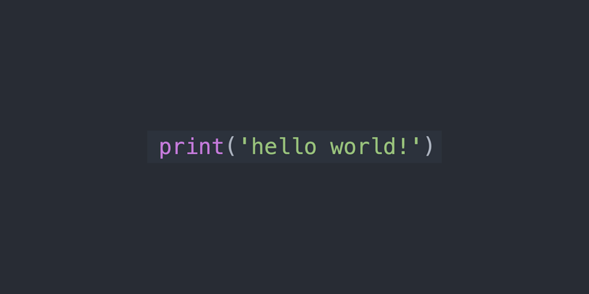

# IntroBioinfo
## Unidad_1
###  Introducción a la consola y línea de comando de bash

`hello word!` 

* Vamos a abrir la terminal. Debe ser un ícono parecido a este:

 En Ubuntu debe estar por default en tu dock. Si no lo encuentras tanto en Mac como en Ubuntu prueba buscar "Terminal" o "Console"

 Una vez abierta deberá verse parecida a esta:

 
 
 La primera línea dice la fecha y hora y "ttys000". ttys viene de "Teletype" ([un poco de historia aquí](http://stackoverflow.com/questions/4532413/what-is-tty-on-freebsd)) y significa que el *input* es nuestro teclado, identificado como ttys000. 

 La segunda línea es la más importante: dice el **nombre del equipo** (Toxic-Avenger en este caso), el **directorio** donde estoy (`~` significa "home directory", lo veremos más adelante) y el **nombre del usuario** con quién estoy en la terminal (en mi caso ToxicAvenger). 

 Notarás que esa línea termina en `$`

 `$` significa que la terminal está corriendo con un interpretador Shell o Bash y por un usuario sin mayores privilegios. Si termina en `#` significa que la estás corriendo como **root** que es un "súper usuario" con permisos para desconfigurarlo todo, ten cuidado.
 
