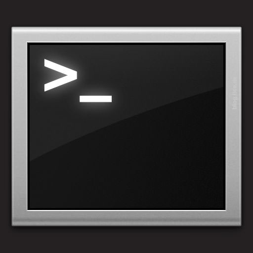

# IntroBioinfo
## Unidad_1
###  Introducción a la consola y línea de comando de bash

`hello word!` 


* Vamos a abrir la terminal. Debe ser un ícono parecido a este:



 En Ubuntu debe estar por default en tu dock. Si no lo encuentras tanto en Mac como en Ubuntu prueba buscar "Terminal" o "Console"

 Una vez abierta deberá verse parecida a esta:

 
 
 La primera línea dice la fecha y hora y "ttys000". ttys viene de "Teletype" ([un poco de historia aquí](http://stackoverflow.com/questions/4532413/what-is-tty-on-freebsd)) y significa que el *input* es nuestro teclado, identificado como ttys000. 

 La segunda línea es la más importante: dice el **nombre del equipo** (Toxic-Avenger en este caso), el **directorio** donde estoy (`~` significa "home directory", lo veremos más adelante) y el **nombre del usuario** con quién estoy en la terminal (en mi caso ToxicAvenger). 

 Notarás que esa línea termina en `$`

 `$` significa que la terminal está corriendo con un interpretador Shell o Bash y por un usuario sin mayores privilegios. Si termina en `#` significa que la estás corriendo como **root** que es un "súper usuario" con permisos para desconfigurarlo todo, ten cuidado.

 #### ¿Qué significa que La Terminal tenga un interpretador? 

 Que le damos comandos y nos responde. 

 El la Terminal no existe el *point and click*. El que funcione como una Línea de Comando significa que tienes que darle comandos (Instrucciones) de qué hacer línea por línea. 

 Por ejemplo:

 `date` nos responde la fecha actual

 `echo algo` nos responde el texto "algo". También lo puedes utilizar con más de una palabra. 

 `echo hello world`
 `Adios mundo cruel`

 Algo así debe verse tu terminal:

  

 Pero por practicidad y para facilitar el copiar-pegar en vez de la imágen de la Terminal pondré los comandos (código) y sus resultados, así:
```
Toxic-Avenger:~ ToxicAvenger$ 
Toxic-Avenger:~ ToxicAvenger$ date
Tue Feb  2 22:26:40 CST 2021
Toxic-Avenger:~ ToxicAvenger$ echo algo
algo
Toxic-Avenger:~ ToxicAvenger$ echo Hello world!
Hello world!
Toxic-Avenger:~ ToxicAvenger$ echo Adios mundo cruel
Adios mundo cruel
Toxic-Avenger:~ ToxicAvenger$ 
```
Que es lo mismo que:

```
$ date
Tue Feb  2 22:26:40 CST 2021
$ echo algo
algo
$ echo hello world
hello world
$ echo Adios mundo cruel
Adios mundo cruel
``` 
Para facilidad visual, de aquí en adelante utilizaremos la opción con el texto a partir de `$` (al menos que sea pertinente ver lo que hay antes). Este formato lo encontrarás en la mayoría, si no es que en todos los foros de ayuda, libros, manuales, etc...

**Ojo** Se pone `$` solo para **distinguir** que lo que sigue es un comando que debes poner en la Terminal, por lo que **NO** debes copiar los comandos a tu terminal incluyendo el `$`.
 
**Pregunta obligada**: ¿Qué pasa si intentas correr el comando  `$ algo`?:

La terminal dirá:

    -bash: algo: command not found

Que quiere decir que no existe el comando `algo`. 

De igual forma si corres `$ date` (incluyendo el `$`) te dirá que no existe el comando `$`, aunque `date` sí sea un comando.

La práctica hace al maestro. A continuación veremos algunos de los comandos básicos, pero para practicar más parte de la tarea será resolver los siguientes cursos prácticos:

* Terminar el curso [Learn the Command Line de CodeAcademy](https://www.codecademy.com/learn/learn-the-command-line).

* Adentrarse en el bosque con este [juego de bash](http://web.mit.edu/mprat/Public/web/Terminus/Web/main.html).

### La terminal de R

`R` es un programa que funciona con la línea de comando y por lo tanto puede correrse desde la terminal de varias formas o en su propia terminal.

```{bash}
$ R
R version 3.2.2 (2015-08-14) -- "Fire Safety"
Copyright (C) 2015 The R Foundation for Statistical Computing
Platform: x86_64-apple-darwin13.4.0 (64-bit)

R is free software and comes with ABSOLUTELY NO WARRANTY.
You are welcome to redistribute it under certain conditions.
Type 'license()' or 'licence()' for distribution details.

  Natural language support but running in an English locale

R is a collaborative project with many contributors.
Type 'contributors()' for more information and
'citation()' on how to cite R or R packages in publications.

Type 'demo()' for some demos, 'help()' for on-line help, or
'help.start()' for an HTML browser interface to help.
Type 'q()' to quit R.

> 1+1
[1] 2
> quit()
```

Con `quit()` salgo de la Terminal de R y vuelvo a la Terminal de bash.

R también tiene su propia terminal (lo que sale cuando abres R via su ícono). Sin embargo, nosotros ocuparemos RStudio, que es una interfaz visual que integra la terminal de R con varias funcionalidades útiles e intuitivas.

 
