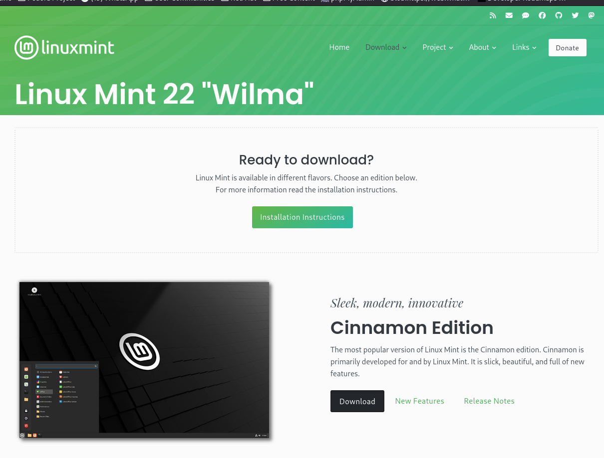
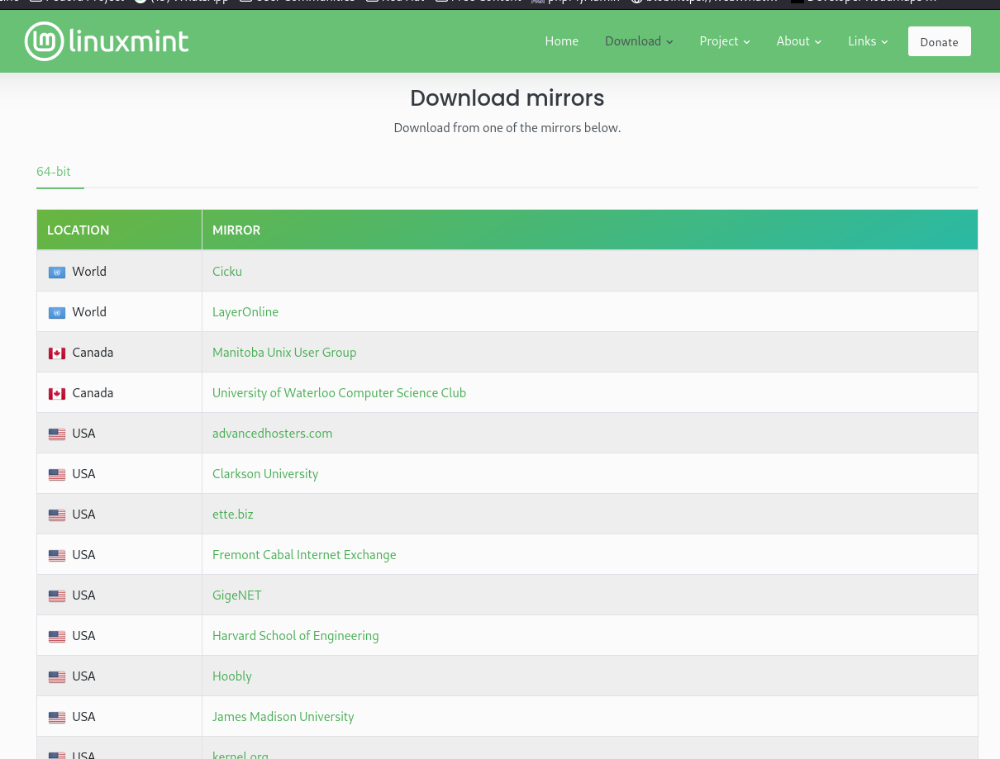
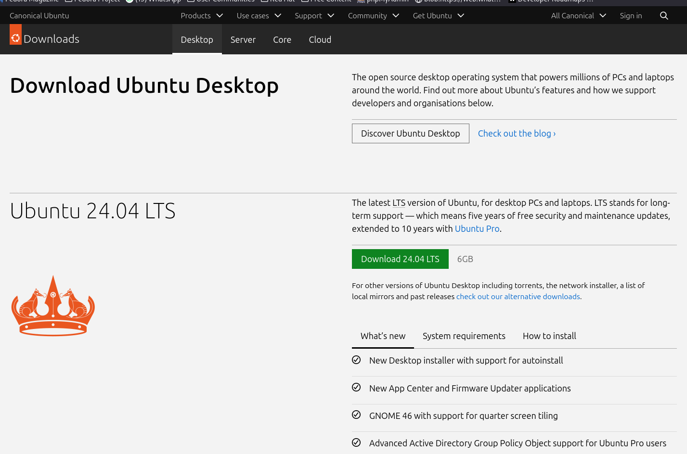

# Tutorial de Instalación de Linux (GNU/Linux).

Este pequeño tutorial está escrito para que cualquier estudiante que esté cursando la materia pueda instalar este OS en su ordenador.
Incluye la explicación para instalarlo junto a Windows para tener ambos sistemas operativos.

Puedes obtener ayuda del autor de este tutorial mandando mensaje a @Changeryto en Github, o por telegram en @Senado\_y\_Pueblo\_de\_Roma.

## 0. Breve reseña histórica.

__Esta primera sección describe un pequeño antecedente histórico de Linux (o más adecuadamente GNU/Linux), puedes saltarla sin problema, pero te prometo que vale la pena.__

_Me gustaría interferir por un momento. A lo que te estás refiriendo como Linux, es en realidad, GNU/Linux, (...)._

\- Autor desconocido.

Este sistema operativo deriva de una reimplementación del sistema operativo Unix original creado en _AT&T Bell Laboratories_, por Ken Thompson y Dennis Ritchie en 1969.

El proyecto nació con la intención original de mejorar el rendimiento de mejorar el rendimiento de un videojuego (no es broma) llamado _Space Travel_, que en el sistema operativo MULTICS resultaba tan ineficiente, que cada partida costaba al rededor de 75 dolares.

Sin embargo las utilidades y herramientas que finalmente desarrollaron fueron tan avanzadas que Unix llamó la atención de los laboratorios, finalmente financiando el proyecto y comercializando la licencia de distribución (una demanda por monopolio impedía a la empresa comercializar el sistema operativo directamente).

Cuando las empresas empezaron a restringir el acceso al código fuente de los programas, y la libertad para compartir modificaciones del mismo, Richard Stallman, ingeniero en el Laboratorio de Inteligencia Artificial del MIT, obsesionado con la idea de la libertad de los usuarios para revisar, compartir y modificar los programas que corren en tu propio hardware, crea el proyecto GNU (acrónimo de GNU's Not Unix) en 1983, con la intención de crear un sistema operativo parecido a Unix, pero sin las restricciones de un software bajo licencia propietaria, bajo la idea de ser "software libre", software que puedes revisar, modificar y compartir tanto en su forma originar como con tus propias modificaciones

Para esto, Stallman tuvo que renunciar a su puesto en el MIT para evitar que esta institución reclamara los derechos sobre este proyecto.
Funda la Free Software Foundation en 1985, fundación orientada a promover y proteger el software libre, junto a abogados, crea la licencia GPL (este repositorio cuenta con la licencia GPL en su tercera versión) que permite a quien lo desee, revisar, modificar y compartir el software, pero no apropiarse del proyecto ni usarlo en versiones propietarias.

Esta base inició el crecimiento de una comunidad creciente de programadores que aportaban su propio trabajo al proyecto GNU y demás proyectos amparados bajo los ideales y legalidad del Software Libre.

Para 1991, el proyecto tenía gran parte del sistema operativo compelto, sin embargo aún no tenían un kernel estable (un kernel o núcelo es la parte del sistema operativo que se comunica directamente con el hardware, evitando que cualquier otro programa tenga que hacerlo), en general considerada la parte más importante de cualquier sistema operativo.

Ese mismo año, Linus Torvalds, por entonces estudiante de ingeniería de software en la Universidad de Helsinki (Finlandia), al considerar que las licencias contemporáneas de Unix eran extremadamente costosas, decide iniciar el desarrollo de su propio kernel, lo libera eventualmente bajo la licencia GPL, el proyecto toma gran revuelo, recibiendo aportes de la comunidad del software libre, y eventualmente ambos proyectos, el kernel Linux y los programas del proyecto GNU, son usados en conjunto.

El crecimiento de ambos proyectos eventualmente logra un sistema operativo tan confiable que actualmente es el preferido de los servidores de cualquier organización u empresa, y por desarrolladores de software y científicos de datos de todo tipo.

## 1. Elegir el sistema operativo

Actualmente, GNU/Linux se distribuye en distros o distribuciones creadas por distintas organizaciones y empresas, una distribución es resumidamente, el conjunto de programas y configuraciones que forman el sistema operativo en particular.

Como los principios del software libre lo declaran, cualquiera puede distribuir sus propias modificaciones de un software libre, por lo que algunas distribuciones fueron creadads a partir del trabajo creado por otras.

Las distribuciones más amables con usuarios nuevos, que además cuentan con una enorme base de usuarios dispuestos a ayudar a otros en foros en línea, son las siguientes.

1. Linux Mint. Una distribución derivada de Ubuntu, con la mayoría de configuraciones listas y un entorno de escritorio muy intuitivo similar a Windows. [(Descargalo aquí)](https://linuxmint.com/download.php)
2. Ubuntu. Una distribución derivada de Debian, por defecto tiene el entorno de escritorio Gnome, intuitiva pero requiere adapatarse, es la distribución más pesada y con frecuencia menos optimizada de las comentadas aquí, pero tiene la comunidad de mayor tamaño. [(Descargalo aquí)](https://ubuntu.com/download/desktop)
3. Fedora. Una distribución de actualización frecuente, con interfaz Gnome, pero usualmente con mejor compatibilidad para hardware infrecuente, como las pantallas táctiles en una laptop. Al no estar basado en Debian ni en Ubuntu la comunidad es más reducida, aún así es lo suficientemente grande para cubrir sin dificultad la mayoría de preguntas de cualquier usuario. [(Descargalo aquí)](https://fedoraproject.org/es/workstation/download)

Cualquier distriución te permitirá trabajar en este curso.

Es recomendable __descargar el ISO la última versión LTS__.

### Linux Mint

Si has escogido Linux Mint, selecciona el botón "Download" presente debajo de "Cinnamon Edition"

Te redirige a esta página, baja hasta __Download mirrors__ y selecciona cualquiera.

Inmediatamente el archivo .iso empezará su descarga.

### Ubuntu

Selecciona "Download <versión> LTS"

Inmediatamente empezará la descarga.

### Fedora

Para seguir este tutorial, selecciona el botón de descarga al lado de Fedora Workstation <versión> Live ISO (que se encuentra debajo de __Para sistemas Intel y AMD x86_64__), inmediatamente comensará la descarga del archivo .iso

## 2. Grabar el archivo ISO en una memoria USB.
