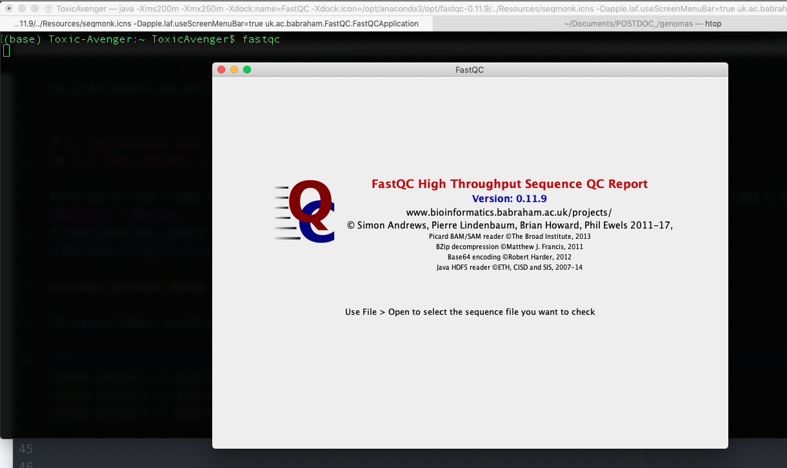

# Unidad_2 : Introducción a la programación

##  Control de calidad de secuencias NGS

Las lecturas crudas obtenidas del secuenciador en Next Generation Sequencing (NGS) pueden contener secuencias de adaptadores usados en la secuenciación, contaminantes y sitios con bajas calidades.
Comúnmente en el extremo 3' de las lecturas posee una menor calidad que el extremo 5'.
El procesamiento de las lecturas para eliminar las secuencias pertenecientes a adaptadores y los pares de bases con baja calidad se denomina Trimming.
Para realizar un trimming adecuado de lecturas se debe hacer un análisis previo de la calidad de la secuenciación mediante el programa FastQC.

### generamos una carpeta en donde estén nuestros genomas o genoma

```
mkdir migenomaX
cd migenomaX
```

##  [FastQC](https://www.bioinformatics.babraham.ac.uk/projects/fastqc/)

FastQC es un programa diseñado para detectar posibles problemas en conjuntos de datos de secuenciación de alto rendimiento. Ejecuta un conjunto de análisis en uno o más archivos de secuencias en bruto en formato fastq o bam y produce un informe que resume los resultados.

Los modernos secuenciadores de alto rendimiento pueden generar decenas de millones de secuencias en una de secuencias en una sola pasada. Antes de analizar esta secuencia para sacar conclusiones biológicas, hay que realizar siempre algunas comprobaciones sencillas de control de calidad para asegurarse de que los datos brutos tienen un buen aspecto y que no hay problemas o sesgos en los datos que puedan afectar a su uso.
utilizarlos.
La mayoría de los secuenciadores generan un informe de control de calidad como parte de su proceso de análisis, pero éste normalmente sólo se centra en identificar los problemas generados por el propio secuenciador.

El **objetivo** de FastQC es proporcionar un informe de control de calidad que pueda detectar los problemas que se originan en el secuenciador o en el material de la biblioteca de la cual partimos
**FastQC** puede ejecutarse de dos maneras: puede ejecutarse como una aplicación interactiva (versión gráfica) independiente para el análisis inmediato de un pequeño número de archivos FastQ, o puede ejecutarse en un modo no interactivo (terminal), en el que puede integrarse en un proceso de análisis más para el procesamiento sistemático de un gran número de archivos.


# 2. Operaciones básicas
## 2.1 Cómo abrimos un archivo

Para abrir uno o más archivos de secuencia de forma interactiva, simplemente ejecute el programa y seleccione *Archivo > Abrir*.
A continuación, podrá seleccionar los archivos que desee analizar.


**¿cómo abrimos desde la terminal?**

1) necesitamos instalar FastQC

```
conda install -c bioconda fastqc
conda install -c bioconda/label/broken fastqc
conda install -c bioconda/label/cf201901 fastqc
```




Existen varias maneras de instalar:


Los archivos recién abiertos aparecerán inmediatamente en el conjunto de pestañas de la parte superior de la pantalla.
Debido al tamaño de estos archivos, puede tardar un par de minutos en abrirlos. FastQC
funciona con un sistema de colas en el que sólo se abre un archivo a la vez, y los nuevos archivos
nuevos archivos esperan hasta que los archivos existentes hayan sido procesados.
FastQC admite archivos en los siguientes formatos:

* 
* Casava FastQ files*
* Colorspace FastQ
* GZip comprimidos FastQ
* 
* 
* SAM/BAM Sólo mapeado (normalmente utilizado para datos de espacio de color)

Por defecto, FastQC intentará adivinar el formato del archivo a partir del nombre del archivo de entrada. Todo lo que
que termine en .sam o .bam se abrirá como un archivo SAM/BAM (utilizando todas las secuencias, mapeadas
y no mapeadas), y todo lo demás será tratado como formato FastQ. Si desea
anular esta detección y especificar el formato de archivo manualmente, puede utilizar el filtro
en el selector de archivos para seleccionar el tipo de archivo que va a cargar. Es necesario
utilizar el selector desplegable para que el programa utilice los modos de archivo BAM mapeado o Casava
ya que estos no se seleccionan automáticamente
