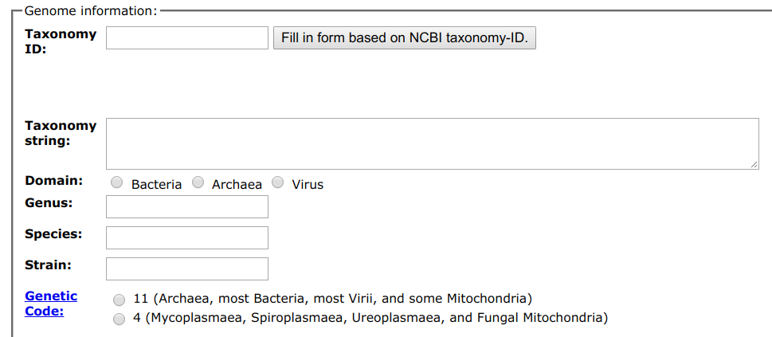
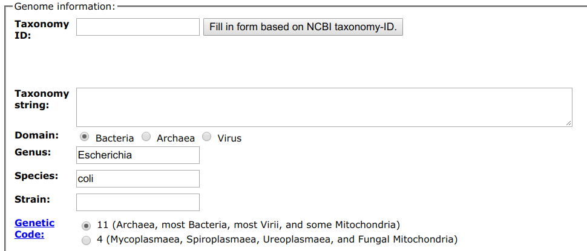
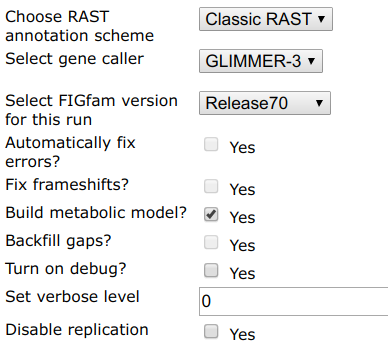

# 5.0 Anotación

La anotación del ADN de un genoma consiste en la identificación estructural de genes, regiones codificantes y motivos, así como la identificación funcional de esas regiones. La anotación puede ser tan compleja como queramos o tan general como lo permita la herramimenta. 
Existenn diferentes herramientas para la anotación de genomas bacterianos, las más comúnes son PROKKA, RAST y PATRIC.

Los algoritmos principales para realizar la anotacion son: [prodigal](https://github.com/hyattpd/Prodigal), [genmark](http://exon.gatech.edu/GeneMark/) y 
[Glimmer](http://ccb.jhu.edu/software/glimmer/index.shtml).


## 5.1 Prokka

Esta basado en .perl y tiene muchos complementos de perl.
Este programa utiliza prodigal para la obtencion de los open reading frame (ORF)

Usualmente sólo requerimos el input y la carpeta de salida. Este software es muy rápido, pero perdemos algo de calidad en el anotado.


```
cd $HOME/Ensamble

mkdir -p 05_annotation

cp 02_assembly/denovo_spades/ecoli/scaffolds.fasta 05_annotation/spades_assembly.fasta

cp 02_assembly/denovo_velvet/ec_31/contigs.fa 05_annotation/velvet_assembly.fasta

source activate annotation

prokka --outdir 05_annotation/ec_spades_prokka --gcode 11 --evalue 1e-6 \
    --prefix ec_spades 05_annotation/spades_assembly.fasta

prokka --outdir 05_annotation/ec_velvet_prokka --gcode 11 --evalue 1e-6 \
    --prefix ec_velvet 05_annotation/velvet_assembly.fasta

conda deactivate
```

#### Archivos de salida:

|Extension | Description |
| --- | --- |
|.gff	| This is the master annotation in GFF3 format, containing both sequences and annotations. It can be viewed directly in Artemis or IGV. |
|.gbk	| This is a standard Genbank file derived from the master .gff. If the input to prokka was a multi-FASTA, then this will be a multi-Genbank, with one record for each sequence. |
|.fna |	Nucleotide FASTA file of the input contig sequences. |
|.faa	| Protein FASTA file of the translated CDS sequences. |
|.ffn	| Nucleotide FASTA file of all the prediction transcripts (CDS, rRNA, tRNA, tmRNA, misc_RNA) |
|.sqn	| An ASN1 format “Sequin” file for submission to Genbank. It needs to be edited to set the correct taxonomy, authors, related publication etc. |
|.fsa	| Nucleotide FASTA file of the input contig sequences, used by “tbl2asn” to create the .sqn file. It is mostly the same as the .fna file, but with extra Sequin tags in the sequence description lines. |
|.tbl	| Feature Table file, used by “tbl2asn” to create the .sqn file. |
|.err	| Unacceptable annotations - the NCBI discrepancy report. |
|.log	| Contains all the output that Prokka produced during its run. This is a record of what settings you used, even if the –quiet option was enabled. |
|.txt	| Statistics relating to the annotated features found. |
|.tsv	| Tab-separated file of all features: locus_tag,ftype,len_bp,gene,EC_number,COG,product |

## 

+ Otra manera, muy popular por cierto, es realizar una anotación automatizada en el servidor web RAST,
accesible desde la página.


+ Es necesario registrarse.


+ Puedes lanzar varias anotaciones simultaneas, el servidor indicará cuál es la carga de trabajo actual.


+ Vamos a la pestaña **Your jobs** > **Upload new job**


+ Seleccionamos el archivo de los contigs, A5 en este caso.


+ Nos da un resumen del genoma.


+ En caso de ser un genoma resecuenciado podemos llenar los campos con la información de la referencia.


+ En este caso sólo selecciono el código 11 para codones de bacteria y lleno los campos de género y especie.


Seleccionamos el algoritmo para anotación: GLIMMER, RAST



Enviamos nuestra secuencia y el sistema nos notificará vía correo electrónico cuando nuestra anotación esté lista.


## 5.3 Evaluación de ensamble y anotación.


+ Spades:

```
cd $HOME/Ensamble

source activate annotation

wget -P 05_annotation/ https://ftp.ncbi.nlm.nih.gov/genomes/all/GCF/000/005/845/GCF_000005845.2_ASM584v2/GCF_000005845.2_ASM584v2_genomic.fna.gz

quast.py 05_annotation/spades_assembly.fasta \
  -R 05_annotation/GCF_000005845.2_ASM584v2_genomic.fna.gz \
  -g 05_annotation/ec_spades_prokka/ec_spades.ffn \
  -1 01_qc/ecoli_S01_R1.trim.fastq.gz -2 01_qc/ecoli_S01_R2.trim.fastq.gz \
  -t 4 -o 05_annotation/spades_prokka_quast

conda deactivate
```

+ Velvet:

```
cd $HOME/Ensamble

source activate annotation

wget -P 05_annotation/ https://ftp.ncbi.nlm.nih.gov/genomes/all/GCF/000/005/845/GCF_000005845.2_ASM584v2/GCF_000005845.2_ASM584v2_genomic.fna.gz

quast.py 05_annotation/velvet_assembly.fasta \
  -R 05_annotation/GCF_000005845.2_ASM584v2_genomic.fna.gz \
  -g 05_annotation/ec_velvet_prokka/ec_velvet.ffn \
  -1 01_qc/ecoli_S01_R1.trim.fastq.gz -2 01_qc/ecoli_S01_R2.trim.fastq.gz \
  -t 4 -o 05_annotation/velvet_prokka_quast

conda deactivate
```

Archivos de salida:

|Extension |	Description |
| --- | --- |
|report.txt |	summary table |
|report.tsv	|tab-separated version, for parsing, or for spreadsheets (Google Docs, Excel, etc) |
|report.tex	|Latex version |
|report.pdf	|PDF version, includes all tables and plots for some statistics |
|report.html |	everything in an interactive HTML file |
|icarus.html |	Icarus main menu with links to interactive viewers |
|contigs_reports/ |	(only if a reference genome is provided) |
|misassemblies_report |	detailed report on misassemblies. |
|unaligned_report :	| detailed report on unaligned and partially unaligned contigs. |
|k_mer_stats/	| (only if –k-mer-stats option is specified) |
|kmers_report : | 	detailed report on k-mer-based metrics. |
|reads_stats/	| (only if reads are provided). |
|reads_report :	| detailed report on mapped reads statistics. |
